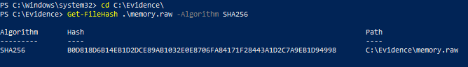

# Phase 03 – Evidence Acquisition

## Objective

The objective of this phase is to acquire volatile memory from the Windows system after the simulated suspicious activity was performed.

The acquired memory image will later be analyzed to identify processes, command-line activity, and other forensic artifacts related to the investigation scenario.

---

## Memory Acquisition

Memory acquisition was performed using WinPmem on the Windows 10 system.

The tool was executed with administrative privileges in order to capture a full memory image of the live system while the simulated artifacts and PowerShell activity were still present.

Generated memory image:

```text
C:\Evidence\memory.raw
```

The resulting memory dump was successfully created and preserved for later forensic analysis.

---

## Evidence Integrity Verification

After the acquisition process was completed, a SHA256 hash was generated to verify the integrity of the memory image.

The following PowerShell command was used:

```powershell
Get-FileHash .\memory.raw -Algorithm SHA256
```

Hash verification is an important forensic practice used to ensure that evidence remains unchanged throughout the investigation process.

---

## Evidence

### SHA256 Hash Verification



---

## Conclusion

A full memory image of the Windows system was successfully acquired using WinPmem.

The evidence was preserved and validated using SHA256 hashing, preparing the environment for the next phase focused on memory forensic analysis with Volatility 3.
