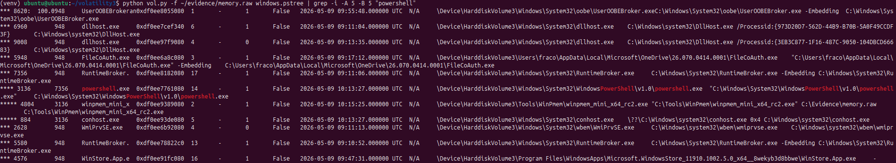
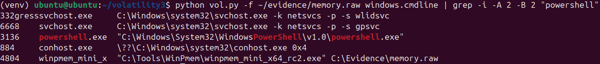
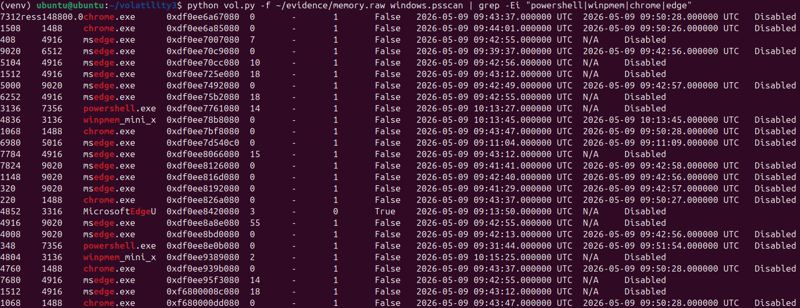

# Phase 04 – Memory Forensics Analysis

## Objective

The objective of this phase is to analyze the acquired memory image using Volatility 3.

The analysis focuses on identifying relevant process activity, command-line evidence, and memory-resident artifacts related to the simulated suspicious activity performed in the previous phases.

---

## Analysis Environment

Memory analysis was performed on the Ubuntu analyst workstation using Volatility 3.

Memory image analyzed:

```text
~/evidence/memory.raw
```

The memory image was previously acquired from the Windows system using WinPmem and verified through SHA256 hashing during the evidence acquisition phase.

---

## System Information

Initial memory analysis was performed to verify that Volatility could correctly identify the operating system profile and process the memory image.

Plugin used:

```bash
windows.info
```

This step confirmed that the memory image was readable and suitable for further forensic analysis.

---

## Process Enumeration

Process enumeration was performed to identify active processes present in memory at the time of acquisition.

Plugin used:

```bash
windows.pslist
```

The output showed standard Windows processes along with user-session activity.  
The process list also confirmed the presence of `powershell.exe`, which was relevant to the simulated suspicious activity.

---

## Process Tree Analysis

A process tree analysis was performed to understand parent-child relationships between processes.

Plugin used:

```bash
windows.pstree
```

Filtered command:

```bash
python vol.py -f ~/evidence/memory.raw windows.pstree | grep -i -A 5 -B 5 "powershell"
```

### Evidence



The process tree output shows `powershell.exe` running within the user session.  
Associated child processes such as `conhost.exe` were also visible, indicating console activity related to the PowerShell process.

The output also shows the WinPmem acquisition utility executed from the PowerShell session, confirming the memory acquisition activity performed during the evidence acquisition phase.

---

## Command-Line Analysis

Command-line analysis was performed to inspect process execution arguments and identify relevant execution context.

Plugin used:

```bash
windows.cmdline
```

Filtered command:

```bash
python vol.py -f ~/evidence/memory.raw windows.cmdline | grep -i -A 2 -B 2 "powershell"
```

### Evidence



The command-line output confirmed the presence of `powershell.exe` in memory.

The output also showed the WinPmem execution command referencing the acquired memory image:

```text
C:\Evidence\memory.raw
```

This confirms that the memory acquisition process was visible in the captured memory image and can be correlated with the previous acquisition phase.

---

## Process Scan

A process scan was performed to identify process objects in memory, including active and residual process artifacts.

Plugin used:

```bash
windows.psscan
```

Filtered command:

```bash
python vol.py -f ~/evidence/memory.raw windows.psscan | grep -Ei "powershell|winpmem|chrome|edge"
```

### Evidence



The process scan identified several relevant process artifacts, including:

- `powershell.exe`
- `winpmem_mini_x`
- `chrome.exe`
- `msedge.exe`

This output is useful because `psscan` can recover process artifacts directly from memory structures, including processes that may no longer appear in the standard active process list.

The presence of browser processes and PowerShell activity provides additional context for user activity during the investigation window.

---

## Key Findings

The memory analysis identified the following relevant findings:

- PowerShell activity was present in memory.
- The PowerShell process was visible in both process listing and process tree analysis.
- Command-line analysis confirmed execution context related to the memory acquisition workflow.
- WinPmem activity was visible in memory, confirming the live acquisition process.
- Process scanning recovered additional process artifacts, including browser-related activity.

---

## Conclusion

Memory forensic analysis was successfully performed using Volatility 3.

The analysis confirmed the presence of PowerShell activity, process relationships, command-line artifacts, and residual process evidence within the memory image.

These findings provide useful context for the investigation and will be correlated with disk-based artifacts in the next phase using Autopsy.
