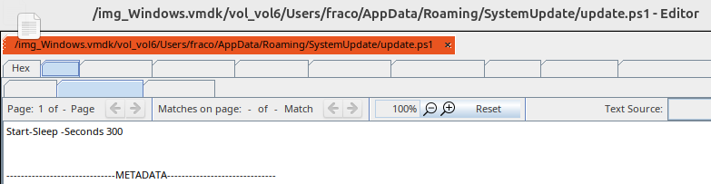

# Phase 05 – Disk Forensics Analysis

## Objective

The objective of this phase is to analyze disk-based artifacts from the Windows system using Autopsy.

This analysis focuses on identifying files and filesystem artifacts related to the simulated suspicious activity and correlating them with the memory findings from the previous phase.

---

## Analysis Environment

Disk analysis was performed on the Ubuntu analyst workstation using Autopsy.

Instead of analyzing only exported logical files, the Windows virtual disk was imported as a full disk data source.

Data source type:

```text
Disk Image or VM File
```

This approach provides better filesystem context and allows artifacts to be reviewed from their original disk location.

---

## Artifact Discovery

During the disk analysis, Autopsy was used to navigate the Windows filesystem and user profile structure and inspect artifacts located under the user's AppData directory.

The following path was identified:

```text
Users/fraco/AppData/Roaming/SystemUpdate
```

Inside this directory, the following files were found:

```text
update.ps1
updater.log
```

These files are related to the simulated suspicious activity created during the incident simulation phase.

---

## PowerShell Script Artifact

The file `update.ps1` was reviewed inside Autopsy.

Path:

```text
/img_Windows.vmdk/vol_vol6/Users/fraco/AppData/Roaming/SystemUpdate/update.ps1
```

The script content was confirmed as:

```powershell
Start-Sleep -Seconds 300
```

### Evidence



This artifact confirms that the PowerShell script observed during the investigation was present on disk inside the user's AppData roaming profile.

The location is relevant because user-writable AppData directories are commonly reviewed during DFIR investigations when analyzing suspicious scripts, persistence mechanisms, or post-compromise artifacts.

---

## Log Artifact

The file `updater.log` was also found in the same `SystemUpdate` directory.

The file contained the following simulated text:

```text
Simulated suspicious file for DFIR analysis
```

This file served as an additional disk artifact associated with the simulated activity.

---

## Correlation With Memory Analysis

The disk findings were correlated with the memory analysis performed in the previous phase.

Memory analysis identified:

- `powershell.exe` activity
- PowerShell-related process context
- command-line artifacts
- process artifacts recovered through `psscan`

Disk analysis confirmed:

- the presence of the PowerShell script on disk
- the suspicious `SystemUpdate` directory under AppData
- an additional supporting log artifact

Together, these findings show how memory and disk evidence can be used together to reconstruct suspicious activity.

---

## Analysis Limitations

The analysis focused on filesystem artifacts relevant to the simulated investigation scenario.

No timestamp-based conclusions were made because timestamp visibility was limited during review. For this reason, the analysis focused on artifact presence, file location, file content, and correlation with memory findings.

---

## Key Findings

The disk forensic analysis identified the following relevant findings:

- A suspicious `SystemUpdate` directory was found under the user's AppData roaming profile.
- The directory contained a PowerShell script named `update.ps1`.
- The script content matched the simulated activity performed during the incident simulation phase.
- An additional file, `updater.log`, was found in the same directory.
- Disk artifacts supported and complemented the memory findings from Volatility.

---

## Conclusion

Disk forensic analysis was successfully performed using Autopsy.

The analysis confirmed the presence of file-based artifacts related to the simulated suspicious activity, including a PowerShell script stored under the user's AppData directory.

These disk findings complemented the memory analysis results and helped strengthen the overall DFIR investigation by correlating volatile and persistent evidence.
